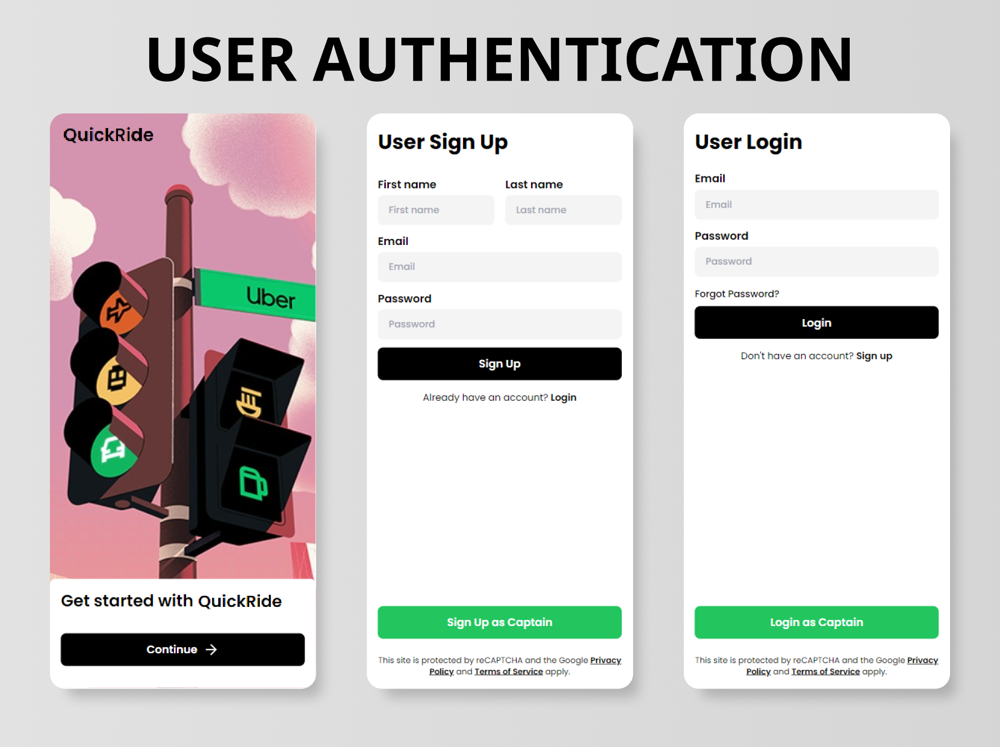
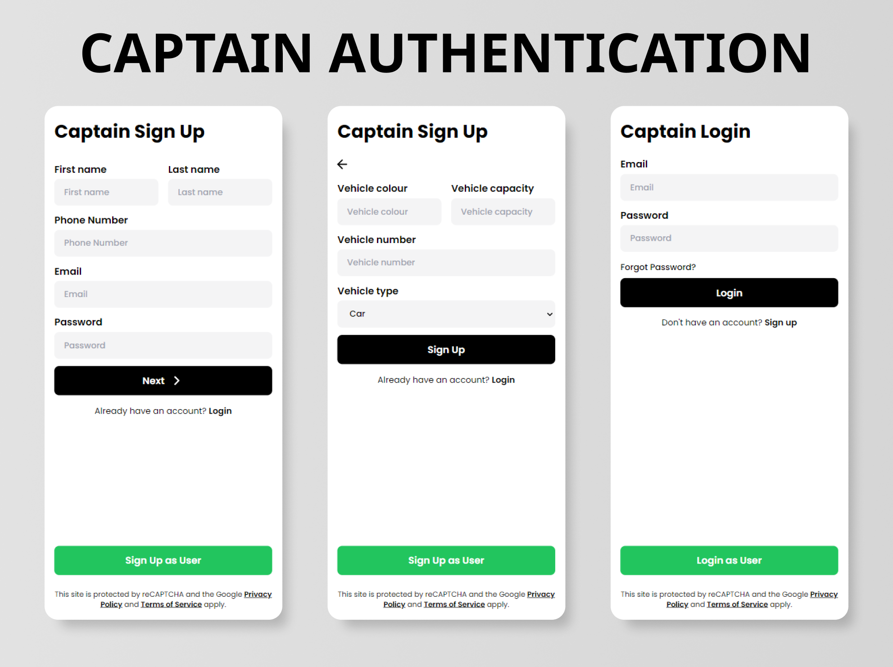
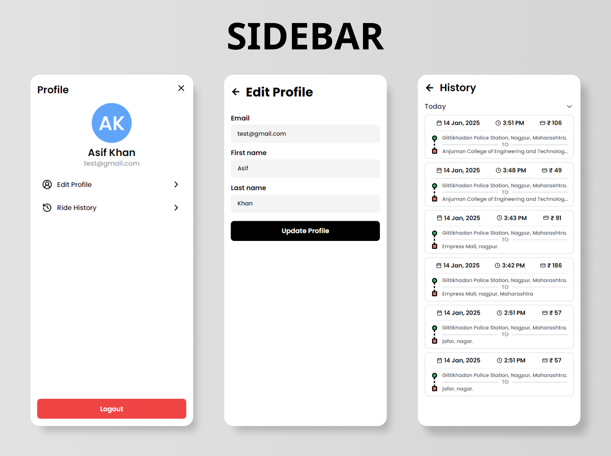
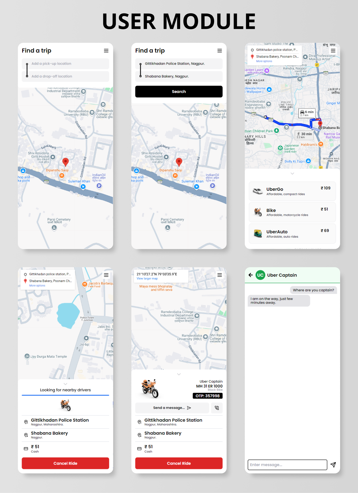
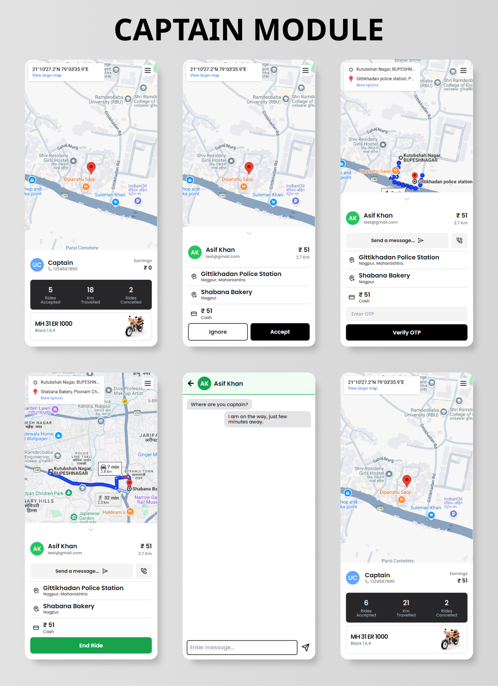

<div align="center">
    
</div>

# QuickRide - Full Stack Ride Booking Application

## 📋 <a name="table">Table of Contents</a>

1. 📃 [Introduction](#introduction)
2. ⚙️ [Tech Stack](#tech-stack)
3. 🔖 [Features](#features)
4. 🖼️ [Screenshots](#screenshots)
5. ⚡ [Quick Start](#quick-start)
6. 🌏 [Environment Variables](#environment-variables)
7. 📜 [Scripts](#scripts)

## <a name="introduction">📃Introduction</a>

ShareRide is a feature-rich project built using modern web and mobile technologies. It replicates the core functionalities of the existing ride booking platforms, including **user authentication**, **ride booking**, **real-time location tracking**, **fare calculation** and **real-time communication**. The application features a clean and responsive user interface, ensuring an intuitive user experience. Designed as a learning and portfolio project, it showcases skills in **frontend and backend development, API integration, and real-time features**.

## <a name="tech-stack">⚙️Tech Stack</a>

<p align="center">
    
</p>

- HTML
- CSS
- JavaScript
- React JS
- Node JS
- Express JS
- Socket IO
- Json Web Token
- Mongo DB
- Tailwind CSS
- Google Cloud Platform
- Node Package Manager

## <a name="features">🔖Features</a>

🔖 **Onboarding Flow:** _Seamless user registration and setup process for easy account creation._

🔖 **Authentication & Authorization:** _Secure login, registration, and logout functionality, ensuring access control for different user roles using `jsonwebtoken`._

🔖 **Profile Management:** _Manage and update user account details directly from the profile screen._

🔖 **Home Screen with Live Location & Google Map Integration:** _Real-time location tracking using `Geo-Location APIs`, with an `interactive map interface`._

🔖 **Google Places Autocomplete:** _Effortless searching for pickup and destination locations with `autocomplete suggestions for any place worldwide`._

🔖 **Find Rides:** _Input pickup and destination locations to search for available rides instantly._

🔖 **Select Rides:** _Choose any nearby vehicle like Car, Bike or Auto._

🔖 **Confirm Ride with Detailed Information:** _View comprehensive ride details, including `estimated time and distance`, `fare price`, and `vehicle information`._

🔖 **Ride Start with OTP Verification:** _Ensure a secure ride experience with `OTP-based verification` at the start of the trip._

🔖 **Real-Time Communication:** _User and Captain can communicate with each other using in app `messaging and calling features implemented using Socket IO`._

🔖 **Pickup and Destination Updates on Map:** _Get `real-time updates of the pickup and destination locations` on the map during the trip through `Google Maps APIs`._

🔖 **Cancel Ride Option:** _Flexibility to cancel rides anytime._

🔖 **Ride History:** _Review and track all previously booked rides in the history section._

## <a name="screenshots">🖼️Screenshots</a>






## <a name="quick-start">⚡Quick Start</a>

### 🪟 Project Structure

```
📂 Backend
📂 Frontend
```

### 1. Clone the Repository

```bash
git clone https://github.com/asif-khan-2k19/QuickRide.git
cd quickride
```

### 2. Install Dependencies

#### For Frontend

```bash
cd Frontend
npm install
```

#### For Backend

```bash
cd ../Backend
npm install
```

### 3. Start the Application

#### Run the Frontend

Open a terminal, navigate to the `Frontend` folder, and run:

```bash
npm run dev
```

#### Run the Backend

Open another terminal, navigate to the `Backend` folder, and run:

```bash
npm run dev
```

### 4. Access the Application

- **Frontend**: Visit [http://localhost:5173](http://localhost:5173) (default React development server port).
- **Backend**: The backend server will typically run on [http://localhost:3000](http://localhost:3000). Adjust the backend port if configured otherwise.

## <a name="environment-variables">🌏Environment Variables</a>

Ensure to set up the required environment variables for both `Frontend` and `Backend`.

#### Frontend (`.env`)

```plaintext
VITE_SERVER_URL = http://localhost:3000
VITE_ENVIRONMENT = development # Change to "production" for deployment
VITE_RIDE_TIMEOUT = 90000 # ride will automatically cancel after 1.5 minutes if no-one accepts the ride
```

#### Backend (`.env`)

```plaintext
PORT = 3000
SERVER_URL = http://localhost:3000 
CLIENT_URL = http://localhost:5173 # Change to deployed frontend url if in production
ENVIRONMENT = development # Change to "production" for deployment
MONGODB_PROD_URL = <your-mongodb-atlas-connection-string>
MONGODB_DEV_URL = mongodb://127.0.0.1:27017/quickRide
JWT_SECRET = <your-json-secret-string>
GOOGLE_MAPS_API = <your-google-maps-api-key>
MAIL_USER = <your-gmail-id>
MAIL_PASS = <your-app-specific-gmail-password>
```

## <a name="scripts">📜Scripts</a>

- **`npm run dev`**: Starts the development server (both frontend and backend).
- **`npm install`**: Installs project dependencies.
